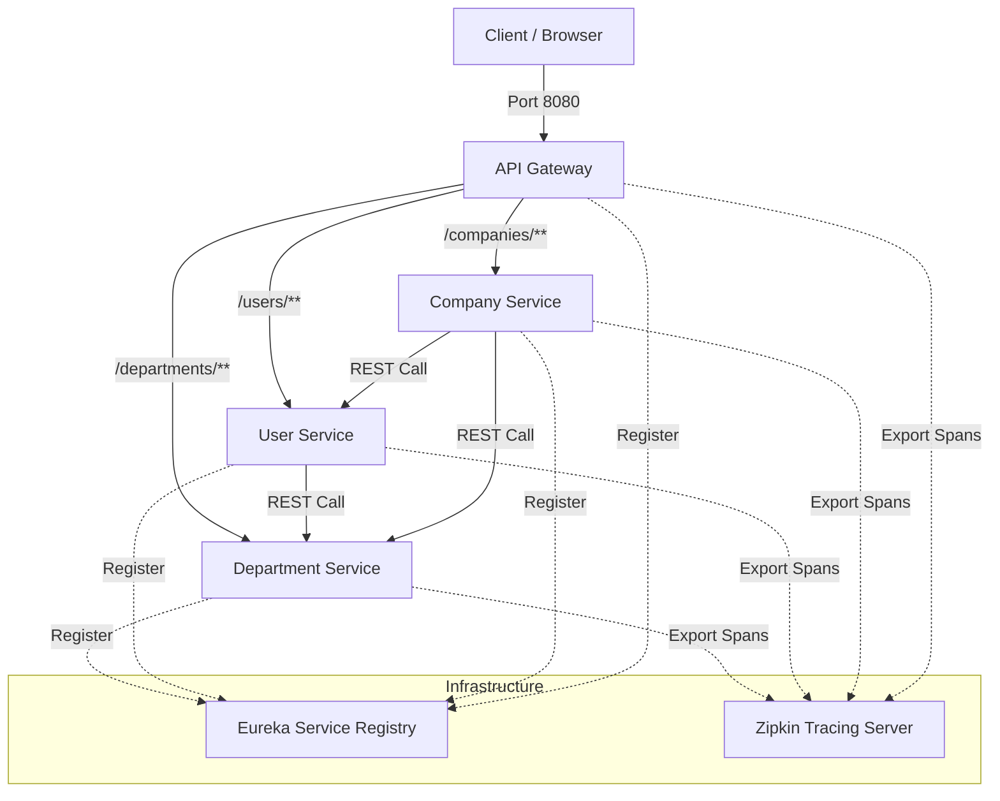

# Microservice Application

A Java and Spring Boot based microservices application demonstrating clean boundaries, service discovery, API routing, inter-service communication, and distributed tracing.

## Architecture Overview

The system is designed with four independent domain and infrastructure microservices, plus an API Gateway serving as the single entry point. 



### Technology Stack
* **Language & Framework:** Java 17+, Spring Boot 3.x
* **Service Discovery:** Spring Cloud Netflix Eureka
* **API Gateway:** Spring Cloud Gateway
* **Persistence:** Spring Data JPA with isolated file-based H2 Databases
* **Tracing:** Micrometer Tracing with Zipkin exporter
* **Utility:** Lombok for reducing boilerplate code

---

## Service Registry & Port Mapping

Each service runs on a dedicated port and registers automatically with the Eureka discovery service:

| Service Name | Port | Context Path | Description |
|:---|:---:|:---|:---|
| `service-registry` | `8761` | `/` | Eureka Discovery Server dashboard |
| `api-gateway` | `8080` | `/` | Spring Cloud Gateway routing requests |
| `department-service` | `8081` | `/departments` | Handles department registration and lookup |
| `user-service` | `8082` | `/users` | Handles user profiles and aggregates department details |
| `company-service` | `8083` | `/companies` | Handles company registration and aggregates departments & users |

---

## API Documentation & Routes

The API Gateway routes client requests transparently based on matching path predicates:

### 1. Company Service (`/companies/**`)

* **Create Company**
  * **Method / Path:** `POST http://localhost:8080/companies`
  * **Payload:**
    ```json
    {
      "companyName": "Acme Corporation",
      "companyDescription": "Global manufacturer of various products"
    }
    ```
  * **Response:**
    ```json
    {
      "companyId": 1,
      "companyName": "Acme Corporation",
      "companyDescription": "Global manufacturer of various products"
    }
    ```

* **Get All Companies**
  * **Method / Path:** `GET http://localhost:8080/companies`

* **Get Company Details (Aggregated)**
  * **Method / Path:** `GET http://localhost:8080/companies/{companyId}`
  * **Response Details:** Fetches company information, retrieves all departments associated with the company from the Department Service, and retrieves all users associated with the company from the User Service.
  * **Response Structure:**
    ```json
    {
      "company": {
        "companyId": 1,
        "companyName": "Acme Corporation",
        "companyDescription": "Global manufacturer of various products"
      },
      "departments": [
        {
          "departmentId": 1,
          "departmentName": "Engineering",
          "departmentCode": "ENG-001",
          "companyId": 1
        }
      ],
      "users": [
        {
          "userId": 1,
          "fullName": "Jane Doe",
          "email": "jane.doe@acme.com",
          "departmentId": 1,
          "companyId": 1
        }
      ]
    }
    ```

### 2. Department Service (`/departments/**`)

* **Create Department**
  * **Method / Path:** `POST http://localhost:8080/departments`
  * **Payload:**
    ```json
    {
      "departmentName": "Engineering",
      "departmentCode": "ENG-001",
      "companyId": 1
    }
    ```

* **Get Department by ID**
  * **Method / Path:** `GET http://localhost:8080/departments/{departmentId}`

* **Get Departments by Company ID**
  * **Method / Path:** `GET http://localhost:8080/departments/companies/{companyId}`

### 3. User Service (`/users/**`)

* **Create User**
  * **Method / Path:** `POST http://localhost:8080/users`
  * **Payload:**
    ```json
    {
      "fullName": "Jane Doe",
      "email": "jane.doe@acme.com",
      "departmentId": 1,
      "companyId": 1
    }
    ```

* **Get User with Department (Aggregated)**
  * **Method / Path:** `GET http://localhost:8080/users/{userId}`
  * **Response Details:** Fetches user details and calls Department Service dynamically to append corresponding department metadata.
  * **Response Structure:**
    ```json
    {
      "user": {
        "userId": 1,
        "fullName": "Jane Doe",
        "email": "jane.doe@acme.com",
        "departmentId": 1,
        "companyId": 1
      },
      "department": {
        "departmentId": 1,
        "departmentName": "Engineering",
        "departmentCode": "ENG-001",
        "companyId": 1
      }
    }
    ```

* **Get Users by Company ID**
  * **Method / Path:** `GET http://localhost:8080/users/companies/{companyId}`

---

## Infrastructure Configuration

### Isolated Databases
Each domain service has an independent file-based **H2 Database** ensuring database-per-service microservice boundaries.
* Database files are persisted inside the `./data/` folder relative to each service execution path.
* H2 Web Console is enabled for convenient local inspection at:
  `http://localhost:<service-port>/h2-console`
  * **Driver Class:** `org.h2.Driver`
  * **Username:** `sa`
  * **Password:** (blank)

### Distributed Tracing
Each service utilizes Micrometer Tracing for distributed correlation.
* **Zipkin Endpoint:** `http://localhost:9411/api/v2/spans`
* **Sampling Rate:** `1.0` (100% of requests are traced for demonstration purposes)
* Tracked HTTP calls automatically share span and trace headers across services through the API Gateway, easing performance bottleneck identification.

---

## Getting Started

### Prerequisites
* Java Development Kit (JDK) 17 or higher
* Maven 3.8+ (or use the provided Maven Wrapper `./mvnw`)
* (Optional) Zipkin Server running on port `9411`

### Running Zipkin (Docker)
```bash
docker run -d -p 9411:9411 openzipkin/zipkin
```

### Build & Run Microservices

For the best experience, start the microservices in the following sequential order:

1. **Service Registry (Eureka)**
   ```bash
   cd service-registry
   ./mvnw spring-boot:run
   ```
   *Verify dashboard is accessible at [http://localhost:8761](http://localhost:8761).*

2. **Domain Microservices**
   Open separate terminals for each service:
   ```bash
   # Start Department Service
   cd department-service
   ./mvnw spring-boot:run
   
   # Start User Service
   cd user-service
   ./mvnw spring-boot:run
   
   # Start Company Service
   cd company-service
   ./mvnw spring-boot:run
   ```

3. **API Gateway**
   ```bash
   cd api-gateway
   ./mvnw spring-boot:run
   ```

All services will register with Eureka within a few seconds, and endpoints can be reached directly via port `8080`.
